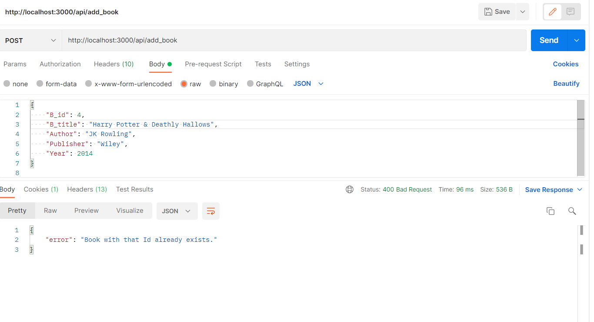

# Ruby On Rails Project

<bold> Submitted by Group 16 </bold>

## Question

Develop a simple RoR MVC REST API to perform CRUD functions.

1. Fetch the data from the database and send the response in JSON.
2. Post the request to the API to perform the database operations. The post request
   method must display the books newly added to the database collection.
3. Create a database to store the details of books.
   Book[B_id, B_title, Author, Publisher, Year]

[Code Link](https://github.com/vimrajesh/books-app)

## Steps to get the code up and running:

1. Configure Ruby on Rails on your machine. [Check here](https://rubyonrails.org/)
2. Clone this repository and open the directory.

```sh
git clone https://github.com/vimrajesh/books-app.git
cd books-app
```

3. Install the gems.

```sh
bundler install
```

4. Run the server.
   rails server
5. To check the server status, run the following command:

```sh
curl http://localhost:3000
```

or visit http://localhost:3000 on your browser.


<p align="center">
    <i>Figure 1: Server Started Successfully</i>
</p>
<br/>

6. You can now use both the web interface as well the API to perform CRUD operations.

```sh
# Web Interface
http://localhost:3000/books
# To access API use the following URL:
http://localhost:3000/api/books
```

7. To get all routes in the RoR application, run the following command in your shell:

```sh
rails routes
```

Or visit the following URL:

```sh
http://localhost:3000/rails/info/routes
```

8. Now, by looking at the routes provided, you can do the respective API calls and web interface operations.

## Model Definition

- You can create your own model using this syntax. We have used MVC Architecture to create the model.

```
rails g model Book B_id: integer B_title:string Author:string Publisher:string Year:integer
```

The following would be created upon execution of the above command.

1.  app/models/books.rb
2.  db/migrate/[date_time]\_create_books.rb

The model on its own generates a unique column named 'id' which is an autoincrement not null field, which can be used to uniquely identify a particular record in the table. This is the primary key. The other fields are the attributes of the model. B_id is a different attribute from the id element.

- The create_books ruby file is used to create the database. This is generated on the above execution. It was then modified to satisfy various constraints.

```ruby
class CreateBooks < ActiveRecord::Migration[6.1]
  def change
    create_table :books do |t|
      t.integer :B_id , null: false,  index: { unique: true }
      t.text :B_title, null: false
      t.text :Author, null: false
      t.text :Publisher, null: false
      t.integer :Year, null: false

      t.timestamps
    end
  end
end
```

- Once this was done, we ran the following command to migrate the changes to the database:

```sh
# /db/migrate/20211113134158_create_books.rb
# To migrate the changes to the database
rails db:migrate
```

The schema generated for the model is as follows:

```ruby
# /db/schema.rb
ActiveRecord::Schema.define(version: 2021_11_13_134158) do

  create_table "books", force: :cascade do |t|
    t.integer "B_id", null: false
    t.text "B_title", null: false
    t.text "Author", null: false
    t.text "Publisher", null: false
    t.integer "Year", null: false
    t.datetime "created_at", precision: 6, null: false
    t.datetime "updated_at", precision: 6, null: false
    t.index ["B_id"], name: "index_books_on_B_id", unique: true
  end

end
```

- Once the schema is set, you can execute to insert few of the the records to the database using the following command:

```sh
# /db/seeds.rb to view the records getting inserted
# To insert the records to the database
# Sample
# Book.create(B_id: '2' ,B_title: 'Introduction to Algorithms', Author: 'CLRS', Publisher: 'MIT Press', Year: '1989')
rails db:seed
```

- The controller file was created in the app/controllers directory named 'books_controller.rb'.
  The contents of the controller file are as follows:

```ruby
require 'json'

class BooksController < ApplicationController
  skip_before_action :verify_authenticity_token

  def home
    @books = Book.all
    render json: @books.as_json(only: [:id, :B_id, :B_title, :Author, :Publisher, :Year]), status: :ok
  end

  def homeRaw
    @books = Book.all
    render json: @books, status: :ok
  end

  def index
    @books = Book.all
  end

  def show
    @book = Book.find(params[:id])
  end

  def display
    begin
      @book = Book.find(params[:id])
      render json: @book.as_json(only: [:id, :B_id, :B_title, :Author, :Publisher, :Year]), status: :ok
    rescue ActiveRecord::RecordNotFound => e
      render json: { error: 'Book not found' } , status: :not_found
    end
  end

  def displayRaw
    begin
      @book = Book.find(params[:id])
      render json: @book, status: :ok
    rescue ActiveRecord::RecordNotFound => e
      render json: { error: 'Book not found' } , status: :not_found
    end
  end

  def new
    @book = Book.new
  end

  def create
    book = Book.create(book_params)
    redirect_to books_path
  end

  def edit
    @book = Book.find(params[:id])
  end

  def addBook
    @book = Book.new(book_params)
    begin
      puts @book
      if @book.save
          render json: {status: 'SUCCESS' , book: @book} , status: :ok
      else
          render json: {status: 'FAILED' , error:@book.errors} , status: :bad_request
      end
    rescue ActiveRecord::RecordNotUnique => e
      render json: { error: 'Book with that Id already exists.' } , status: :bad_request
    end
  end

  def updateBook
    begin
      @book = Book.find(params[:id])
      if @book.update(book_params)
        render json: {status: 'SUCCESS' , book: @book} , status: :ok
      else
        render json: {status: 'FAILED' , error:@book.errors} , status: :bad_request
      end
    rescue ActiveRecord::RecordNotFound => e
      render json: { error: 'Book not found' } , status: :not_found
    end
  end

  def deleteBook
    begin
      @book = Book.find(params[:id])
      if @book.destroy
        render json: {status: 'SUCCESS' , book: @book} , status: :ok
      else
        render json: {status: 'FAILED' , error:@book.errors} , status: :bad_request
      end
    rescue ActiveRecord::RecordNotFound => e
      render json: { error: 'Book not found' } , status: :not_found
    end
  end

  def update
    @book = Book.find(params[:id])
    @book.update(book_params)

    redirect_to book_path(@book)
  end

  def destroy
    @book = Book.find(params[:id])
    @book.destroy

    redirect_to books_path
  end

  private

  def book_params
    params.require(:book).permit(:id, :B_id, :B_title, :Author, :Publisher, :Year)
  end
end
```

- TO get the server started, run the following command:

```sh
rails server
```

- Now that the server is up, you are all set to start using the API.

## API Use

We have used <b>Curl</b> and <b>Postman</b> to demonstrate use of our API. Functionalities provided by the API:

### GET ALL BOOKS

- To get all the books from the database using curl

```sh
curl http://localhost:3000/api/books
```


<p align="center">
    <i>Figure 2: GET All Books using Curl Command</i>
</p>
<br/>

- To get all the books using Postman
<br/><br/>
<p align="center">
    <i>Figure 3: GET All Books using Postman</i>
</p>
<br/>

### GET A BOOK

- To get one single book from the database using curl

```sh
# Sample Syntax curl http://localhost:3000/api/books/<id>
curl http://localhost:3000/api/books/1
```


<p align="center">
    <i>Figure 4: GET one single Book using Curl Command</i>
</p>
<br/>

- To get one single book using Postman
<br/><br/>
<p align="center">
    <i>Figure 5: GET one single Book using Postman</i>
</p>
<br/>

### POST A BOOK

- To add a new book to the database using curl.

```sh
# Sample curl syntax
curl -X POST -H "Content-Type: application/json" -d '{"B_id": "3", "B_title": "The C Programming Language", "Author": "Dennis Ritchie", "Publisher": "Prentice Hall", "Year": "1988"}' http://localhost:3000/api/add_book
```


<p align="center">
    <i>Figure 6: POST a new Book using Curl Command</i>
</p>
<br/>

- To add a new book to the database using Postman
<br/><br/>
<p align="center">
    <i>Figure 7: POST a new Book using Postman</i>
</p>
<br/>

- Handles unique constraint. (B_id is made unique). Demonstrated using Postman.
<br/><br/>
<p align="center">
    <i>Figure 8: Attempt to POST a duplicate B_id book object using Postman</i>
</p>
<br/>

### UPDATE A BOOK

- To update paraameters of a book in the database using curl.

```sh
# Sample url syntax http://localhost:3000/api/update_book/<id>
curl -X PUT -H "Content-Type: application/json" -d '{"Publisher": "Bloomsbury"}' http://localhost:3000/api/update_book/4
```


<p align="center">
    <i>Figure 9: Update parameter of a Book using Curl Command</i>
</p>
<br/>

- To update paraameters of a book in the database using Postman
<br/><br/>
<p align="center">
    <i>Figure 10: Update parameter of a Book using Postman</i>
</p>
<br/>

### DELETE A BOOK

- To delete a book from the database using curl.

```sh
# Sample url http://localhost:3000/api/books/<id>
curl -X DELETE http://localhost:3000/api/books/4
```


<p align="center">
    <i>Figure 11: Delete a Book using Curl Command</i>
</p>
<br/>

- To delete a book from the database using Postman
<br/><br/>
<p align="center">
    <i>Figure 12: Delete a Book using Postman</i>
</p>
<br/>
